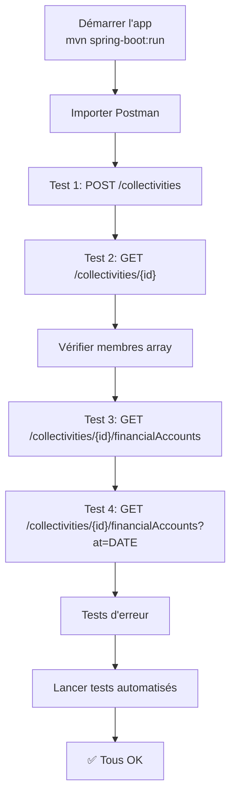

# 📋 Fiche de Référence Rapide - API Endpoints

## 🎯 Résumé des Endpoints Implémentés

```
┌─────────────────────────────────────────────────────────────────┐
│                    COLLECTIVITIES ENDPOINTS                      │
├─────────────────────────────────────────────────────────────────┤
│ POST   /collectivities                    → 201 (Créer)         │
│ GET    /collectivities/{id}               → 200 (Récupérer) NEW │
│ PUT    /collectivities/{id}/informations  → 200 (Mettre à jour)│
│ POST   /collectivities/{id}/membershipFees → 201 (Créer frais) │
│ GET    /collectivities/{id}/membershipFees → 200 (Récupérer)  │
│ GET    /collectivities/{id}/transactions   → 200 (Récupérer)  │
│ GET    /collectivities/{id}/financialAccounts → 200 (NEW)      │
└─────────────────────────────────────────────────────────────────┘

┌─────────────────────────────────────────────────────────────────┐
│                       MEMBERS ENDPOINTS                          │
├─────────────────────────────────────────────────────────────────┤
│ POST   /members                      → 201 (Créer)             │
│ POST   /members/{id}/payments        → 201 (Enregistrer)       │
└─────────────────────────────────────────────────────────────────┘
```

---

## 🆕 NOUVEAUX ENDPOINTS À TESTER

### 1. GET /collectivities/{id}/financialAccounts

#### 📥 Requête 1a: Sans paramètre (Soldes actuels)
```http
GET /api/collectivities/1/financialAccounts HTTP/1.1
Host: localhost:8080
Content-Type: application/json
```

#### 📤 Réponse 1a: (200 OK)
```json
[
  {
    "id": "ACC-001",
    "type": "CASH",
    "balance": 50000.0,
    "currency": "XOF",
    "createdAt": "2024-04-20T10:00:00",
    "lastUpdated": "2024-04-23T15:30:00"
  },
  {
    "id": "ACC-002",
    "type": "BANK",
    "balance": 100000.0,
    "currency": "XOF",
    "createdAt": "2024-04-20T10:00:00",
    "lastUpdated": "2024-04-23T15:30:00"
  },
  {
    "id": "ACC-003",
    "type": "MOBILE_MONEY",
    "balance": 25000.0,
    "currency": "XOF",
    "createdAt": "2024-04-20T10:00:00",
    "lastUpdated": "2024-04-23T15:30:00"
  }
]
```

#### 📥 Requête 1b: Avec paramètre `at` (Soldes historiques)
```http
GET /api/collectivities/1/financialAccounts?at=2024-04-15 HTTP/1.1
Host: localhost:8080
Content-Type: application/json
```

#### 📤 Réponse 1b: (200 OK - Soldes à la date donnée)
```json
[
  {
    "id": "ACC-001",
    "type": "CASH",
    "balance": 30000.0,
    "currency": "XOF",
    "createdAt": "2024-04-20T10:00:00",
    "lastUpdated": "2024-04-15T00:00:00"
  }
]
```

#### ❌ Erreur: Date format invalide
```http
GET /api/collectivities/1/financialAccounts?at=15-04-2024 HTTP/1.1
```
```json
{
  "status": 400,
  "message": "Invalid date format. Use ISO-8601: yyyy-MM-dd",
  "timestamp": "2024-04-23T15:30:00"
}
```

---

### 2. GET /collectivities/{id}

#### 📥 Requête: Récupérer une collectivité
```http
GET /api/collectivities/1 HTTP/1.1
Host: localhost:8080
Content-Type: application/json
```

#### 📤 Réponse: (200 OK)
```json
{
  "id": "1",
  "number": "COL-2024-001",
  "name": "Collectivité Officielle Alpha",
  "description": "Collectivité test avec membres",
  "region": "Région A",
  "createdAt": "2024-04-20T10:00:00",
  "updatedAt": "2024-04-23T12:00:00",
  "totalMembers": 3,
  "members": [
    {
      "id": "MEM-001",
      "firstName": "Jean",
      "lastName": "Dupont",
      "email": "jean.dupont@example.com",
      "phoneNumber": "+223 75 12 34 56",
      "dateOfBirth": "1980-05-15",
      "gender": "MALE",
      "occupation": "AGRICULTURE",
      "joinDate": "2024-04-20",
      "status": "ACTIVE"
    },
    {
      "id": "MEM-002",
      "firstName": "Marie",
      "lastName": "Martin",
      "email": "marie.martin@example.com",
      "phoneNumber": "+223 76 98 76 54",
      "dateOfBirth": "1985-03-20",
      "gender": "FEMALE",
      "occupation": "COMMERCE",
      "joinDate": "2024-04-20",
      "status": "ACTIVE"
    },
    {
      "id": "MEM-003",
      "firstName": "Ahmed",
      "lastName": "Ba",
      "email": "ahmed.ba@example.com",
      "phoneNumber": "+223 77 55 33 22",
      "dateOfBirth": "1990-07-10",
      "gender": "MALE",
      "occupation": "FISHING",
      "joinDate": "2024-04-20",
      "status": "ACTIVE"
    }
  ]
}
```

#### ❌ Erreur: Collectivité inexistante
```http
GET /api/collectivities/999999 HTTP/1.1
```
```json
{
  "status": 404,
  "message": "Collectivity with id 999999 not found",
  "timestamp": "2024-04-23T15:30:00"
}
```

---

## 🔍 Matrice de Test Complète

| # | Endpoint | Paramètres | Statut Attendu | Détails |
|---|----------|-----------|-----------------|---------|
| 1 | POST /collectivities | JSON valide | 201 | Crée 1+ collectivités |
| 2 | GET /collectivities/{id} | ID valide | 200 | Retourne collectivité + membres |
| 2a | GET /collectivities/{id} | ID invalide | 404 | Erreur non trouvé |
| 3 | GET /collectivities/{id}/financialAccounts | - | 200 | Soldes actuels (3 types) |
| 3a | GET /collectivities/{id}/financialAccounts | at=DATE | 200 | Soldes à la date |
| 3b | GET /collectivities/{id}/financialAccounts | at=INVALID | 400 | Format invalide |
| 4 | PUT /collectivities/{id}/informations | JSON valide | 200 | Attribue numéro unique |
| 5 | POST /collectivities/{id}/membershipFees | JSON array | 201 | Crée cotisations |
| 6 | GET /collectivities/{id}/membershipFees | - | 200 | Liste cotisations |
| 7 | GET /collectivities/{id}/transactions | dates | 200 | Filtre par période |
| 8 | POST /members | JSON array | 201 | Crée 1+ membres |
| 9 | POST /members/{id}/payments | JSON array | 201 | Enregistre paiements |

---

## 🧪 Scénarios de Test Complets

### Scenario 1: Test Happy Path (Cas Normal)
```
1. ✅ POST /collectivities          → Créer collectivité A (ID=1)
2. ✅ PUT  /collectivities/1/...    → Attribuer numéro COL-2024-001
3. ✅ POST /members                 → Créer 3 membres
4. ✅ GET  /collectivities/1        → Vérifier members array
5. ✅ POST /collectivities/1/fees   → Ajouter cotisations
6. ✅ GET  /collectivities/1/fees   → Vérifier list
7. ✅ POST /members/1/payments      → Enregistrer paiement
8. ✅ GET  /collectivities/1/accounts    → Vérifier soldes
9. ✅ GET  /collectivities/1/accounts?at=DATE → Vérifier soldes historiques
```

### Scenario 2: Test Edge Cases
```
1. ✅ GET  /collectivities/999 (ID invalide)              → 404
2. ✅ POST /collectivities {}  (Données vides)            → 400
3. ✅ GET  /collectivities/1/accounts?at=invalid-date    → 400
4. ✅ GET  /collectivities/1/accounts?at=2020-01-01      → 200 (date ancienne)
5. ✅ GET  /collectivities/1/accounts?at=2099-12-31      → 200 (date future)
```

### Scenario 3: Test Avec Données Réelles (Simulations)
```
Création d'une collectivité complète:
├─ Nom: "Union des Transporteurs de Bamako"
├─ Numéro: "COL-2024-BKO-001"
├─ Région: "District de Bamako"
├─ Membres (3):
│  ├─ Jean Dupont (AGRICULTURE)
│  ├─ Marie Martin (COMMERCE)
│  └─ Ahmed Ba (FISHING)
├─ Cotisations (2):
│  ├─ Mensuelle: 5 000 XOF
│  └─ Annuelle: 50 000 XOF
├─ Comptes (3):
│  ├─ CASH: 50 000 XOF
│  ├─ BANK: 100 000 XOF
│  └─ MOBILE_MONEY: 25 000 XOF
└─ Paiements (2):
   ├─ 5 000 XOF (CASH)
   └─ 10 000 XOF (MOBILE_MONEY)
```

---

## 🚀 Ordre d'Exécution des Tests



---

## 📊 Codes HTTP à Valider

```
2xx - Succès
├─ 200 OK             : GET, PUT (sans création)
├─ 201 Created        : POST (création d'entités)
└─ 204 No Content     : DELETE, PUT (confirmation)

4xx - Erreur client
├─ 400 Bad Request    : Données invalides, format date incorrect
├─ 401 Unauthorized   : Authentification requise
├─ 404 Not Found      : Ressource inexistante
└─ 409 Conflict       : Conflit (ex: numéro unique dupliqué)

5xx - Erreur serveur
├─ 500 Internal Error : Exception non gérée
└─ 503 Service Unavail: BD inaccessible
```

---

## 🔐 Valeurs de Test Prédéfinies

### IDs de Test
```
Collectivity: 1, 2, 3 ou COL-001, COL-002, COL-003
Member: 1, 2, 3 ou MEM-001, MEM-002, MEM-003
Account: ACC-001, ACC-002, ACC-003
```

### Dates de Test
```
Actuelle: 2024-04-23
Passée:  2024-04-15, 2024-01-01, 2020-01-01
Futur:   2024-12-31, 2025-04-23, 2099-12-31
```

### Montants
```
Positif petit:    5 000
Positif normal:  50 000
Positif grand:  100 000
Zéro:                  0
Négatif (débit):  -5 000
```

---

## ✅ Checklist Finale d'Évaluation

```
ENDPOINTS NOUVELLEMENT AJOUTÉS:
  [ ] GET /collectivities/{id}/financialAccounts - Sans date
  [ ] GET /collectivities/{id}/financialAccounts?at=2024-04-15 - Avec date  
  [ ] GET /collectivities/{id} - Récupère collectivité
  [ ] GET /collectivities/{id} - Inclut array "members"

CODES HTTP CORRECTS:
  [ ] 200 pour GET réussi
  [ ] 201 pour POST de création
  [ ] 404 pour ID inexistant
  [ ] 400 pour données invalides

VALIDATION DES DONNÉES:
  [ ] Format date ISO-8601 (yyyy-MM-dd)
  [ ] Soldes numériques corrects
  [ ] Array members non vide
  [ ] Messages d'erreur explicites

PERFORMANCE:
  [ ] Réponse < 500ms
  [ ] Pas d'erreur de timeout
  [ ] Gestion correcte des grandes listes

DOCUMENTATION:
  [ ] Tests dans Postman importés
  [ ] Tests automatisés compilent
  [ ] Guide README consultable
  [ ] Scripts de test fonctionnels
```

---

**Prêt à tester! 🎯 Utilisez ce document comme référence rapide lors de l'évaluation.**
